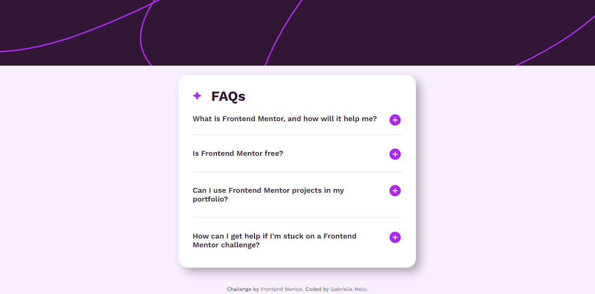

# Frontend Mentor - FAQ accordion

## Sumário

- [Visão Geral](#visão-geral)
  - [O desafio](#o-desafio)
  - [Links](#links)
- [Meu Processo](#meu-processo)
  - [Construído com?](#construído-com?)
  - [O que eu aprendi?](#o-que-eu-aprendi?)
  - [O que preciso focar mais?](#o-que-preciso-focar-mais?)
- [Autor](#autor)

## Visão Geral

## O desafio

O desafio se baseia na criação de um site contendo uma seção Faq, na qual são respondidas possíveis perguntas acerca de um assunto.

É importante que o site tenha um design extremamente parecido com o proposto pela equipe do Frontend Mentor.

Os usuários devem ser capazes de:

- Esconder/mostrar a resposta de uma questão, quando esta for clicada;
- Navegar pelas questões e esconder/mostrar as respostas utilizando a navegação por meio do teclado;
- Visualizar o layout otimizado para a interface dependendo do tamanho da tela do dispositivo utilizado; 
- Ver os estados de foco para todos os elementos interativos da página.

### Links

- Solução URL: (https://www.frontendmentor.io/solutions/faq-accordion-page-using-css-grid-and-flexbox-anfkVy3qn2)

- Live Site URL: (https://gabriellaam.github.io/Faq-Accordion/)

## Meu Processo

### Construído com?

- HTML5
- CSS
- Flexbox
- CSS Grid
- JS 

### O que eu aprendi?

Pude desenvolver meus conhecimentos de JavaScript, pois ainda possuo dificuldades entendendo sua lógica. Nesse projeto aprendi alguns métodos para fazer com que um botão realize uma determinada ação de acordo com os comandos escritos.

Ainda, foi possível evoluir minhas habilidades de CSS. Compreendi melhor o funcionamento das propriedades: "position", "overflow-y", "overflow-x" e "max-height". Além de praticar e entender melhor CSS Grid e Flexbox.

### O que preciso focar mais?

Pretendo continuar praticando Flexbox e CSS Grid, para que no futuro consiga utilizá-los mais facilmente. Também irei estudar e praticar JavaScript para que possa escrever códigos mais otimizados.

## Autor

- Frontend Mentor - [@GabriellaAM](https://www.frontendmentor.io/profile/GabriellaAM)
